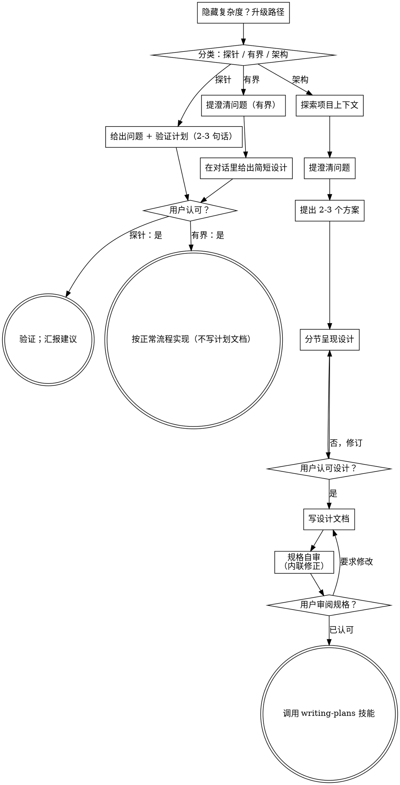

# 把想法梳理成设计

通过自然的协作式对话，把想法变成成型的设计与规格。

先判断这个请求需要多少流程，再走对应路径：理解上下文、打磨想法、给出设计、取得用户认可。

## 建立共识

头脑风暴的产物，是用户能认出来并能加以纠正的理解，根植于他们想达成什么。

1. **挖掘意图。** 用请求和已有上下文识别预期结果、服务对象，以及成功长什么样。缺少这些信息时，先就目的或预期用途提一个聚焦的问题，再提功能或方案。知道应用类型并不能解释用户为什么想要它。补齐缺失需求，不等于要求对方再次授权任务。
2. **把理解写回。** 用一段简短说明概括预期结果、相关约束与成功标准，让用户能评估。把用户说的和你的假设分开写。邀请对方纠正，并在把它当作设计依据之前采纳答复。
3. **把意图带入设计。** 在所选路径的设计产物里保留已达成一致的理解：架构工作写进规格文档，有界工作与探针写进对话内的设计 / 验证。用这份理解去检查拟议的功能与技术选择。

当请求本身已经给出目的与约束时，直接复述这份理解，不要重复问同样的问题。说明保持简洁；重要的是它准确，以及给了对方纠正的机会。

<HARD-GATE>
在采取任何实现动作之前——包括调用实现技能、编写产品代码、搭脚手架、安装产品依赖、创建外部项目——先完成所选路径的前置条件：

- 探针（Spike）：用户认可问题与验证方式。
- 有界（Bounded）：用户认可对话内的简短设计。
- 架构（Architectural）：用户先审阅并认可写下的规格，再审阅写下的实现计划并选定执行方式。对话内认可设计只允许写规格；认可规格只允许调用 writing-plans。

一次回复只认可当时真正呈现的那个阶段。认可一个想法或功能范围，不等于认可尚不存在的产物。从最早未完成的阶段继续；不要把一次认可变成跳过所选路径其余步骤的许可。在前置条件未完成期间，允许只读地探索项目。
</HARD-GATE>

## 三条路径

在提第一个问题之前，先给请求分类并说出分类——"这看起来是有界的，所以我会在这里给个简短设计，而不是写规格"——让用户可以推翻它：

- **探针（Spike）**——可行性问题（"我们能不能……""是否可能……""粗糙点也行"），产物是答案而不是要留下的代码。用 2-3 句话给出问题和你要试什么，得到点头，然后在不牺牲正确性的前提下以最低成本把它弄清楚。不写设计文档，不写规格文件。以建议形式汇报结论；凡是你搭出来的东西都标注为一次性丢弃物。
- **有界（Bounded）**——对仓库里已存在代码做范围清晰的改动：一个新开关、一个小接口、一处单文件修复。光知道应用类型不够——有界意味着你要改的那条流程此刻就在仓库里可读。若没有可改的既有流程，任务就不是有界。问那些真正重要的澄清问题，把简短设计放在对话里（几句话到几段），然后**停下**。只有在用户对这份设计说"是"之后才开始实现——有界任务的认可和架构任务一样，是硬门槛。不写规格文件，不写实现计划文档。
- **架构（Architectural）**——新项目、新子系统、会重构组件组合方式或改动他人依赖的接口的改动。走完整流程：提问、方案、分节设计、写规格，然后调用兄弟技能 writing-plans。

两条路径之间存疑时，取更重的那条。棘轮是单向的：任务中途发现的隐藏复杂度会把路径往上推——停下、说明、升级。中途不降级。

## 反模式："太简单了，不需要认可"

每条路径都以用户在实现前认可所需设计收尾。有界改动可能只需对话里两句话。一个新的待办清单项目属于架构级，需要写规格并交接规划。让产物的规模匹配所选路径；实现前先完成该路径的评审。

## 危险信号

| 想法 | 现实 |
|---------|---------|
| "这太简单了，不需要设计" | 按所选路径走：有界改动给简短对话设计；架构改动给写下的规格并交接规划。 |
| "我就叫它有界，跳过规格" | 为了跳过工作而抓一个标签，本身就是存疑——取更重的路径。 |
| "它是有界的、设计也很显然——我边给他们看边开工" | 门槛是认可，不是设计的长短。先呈现，然后停下等"是"。 |
| "我懂这类应用，所以它是有界的" | 有界衡量的是仓库，不是你的熟悉度。新项目没有既有流程——它是架构级。 |
| "探针能跑通，所以我把代码留下" | 探针的产物是答案。留下代码是一个新请求——重新分类。 |
| "它变大了，但我快做完了——不用重新分类" | 隐藏复杂度会中途升级路径。停下并说明。 |
| "他们认可了探针，所以后续改动也算认可了" | 每个任务都有自己的分类和自己的认可。 |

## 清单

先分类、说出路径，然后在主代理的回复里用编号清单列出这条路径上的每一项待办，按顺序完成。（Eta 里没有 todo 工具，待办就写在回复正文里。）

**探针：**
1. **探索项目上下文**——够用来框定验证即可
2. **给出问题 + 验证计划**——2-3 句话
3. **取得认可**——点头即可
4. **验证**——在不牺牲正确性的前提下尽量省
5. **汇报结论**——一条建议；把搭出来的东西标注为一次性丢弃物

**有界：**
1. **探索项目上下文**——看文件、文档、最近提交
2. **提澄清问题**——一次一个，问真正重要的
3. **在对话里给出简短设计**——方案、涉及文件、测试方式
4. **取得认可**——停下，等明确的"是"；把设计呈现和开工放在同一口气里，就是跳过门槛
5. **实现**——走正常开发流程（TDD 适用）；不写计划文档

**架构：**
1. **探索项目上下文**——看文件、文档、最近提交
2. **提澄清问题**——一次一个，理解目的 / 约束 / 成功标准
3. **提出 2-3 个方案**——附取舍与你的推荐
4. **呈现设计**——按复杂度分节呈现，每节后取得用户认可
5. **写设计文档**——保存到 `docs/superpowers/specs/YYYY-MM-DD-<topic>-design.md` 并提交（主代理用 terminal 完成）
6. **规格自审**——快速内联检查占位符、矛盾、歧义、范围（见下）；可选地把规格派给一个 role="review" 的子代理复核，模板见 `spec-document-reviewer-prompt.md`
7. **用户审阅写下的规格**——请用户在继续前审阅规格文件
8. **转入实现**——调用本目录下的兄弟技能 writing-plans 来创建实现计划

## 流程图

**终点状态与路径绑定。** 架构路径：头脑风暴之后你唯一要调用的技能就是 writing-plans——绝不要调用任何其他实现技能。有界路径：认可之后直接走正常开发流程实现，不写计划文档。探针路径：终点是一条汇报出来的建议。

## 过程

下面各小节服务于有界与架构两条路径（探针在"呈现验证方式、得到点头"就停下）。从**探索方案**往后的深度属于架构路径——对有界工作而言，上下文加几个问题加一份对话内简短设计，就是全部流程。

**理解想法：**

- 先看项目当前状态（文件、文档、最近提交）
- 在提细节问题之前先评估范围：如果请求描述了多个相互独立的子系统（例如"做一个带聊天、文件存储、计费和分析的平台"），立刻标出来。别把问题花在一个需要先分解的项目细节上。
- 如果项目大到一份规格装不下，帮用户拆成子项目：哪些是相互独立的部分、它们怎么关联、按什么顺序建？然后按正常设计流程对第一个子项目做头脑风暴。每个子项目各有自己的 规格 → 计划 → 实现 循环。
- 对范围合适的项目，一次一个问题地打磨想法
- 尽量用多选问题，开放式也可以
- 每条消息只问一个问题——若某话题需要更多展开，拆成多个问题
- 聚焦于理解：目的、约束、成功标准

**探索方案：**

- 提出 2-3 个不同方案并给出取舍
- 用对话方式呈现选项，附上你的推荐与理由
- 先讲你推荐的方案，并解释为什么
- 无情地 YAGNI——从每个方案和设计里砍掉不必要的功能

**呈现设计：**

- 当你确信已理解要建什么，就呈现设计
- 每一节按它的复杂度伸缩：简单就几句话，微妙就写到 200-300 字
- 每节之后问一下目前看着对不对
- 覆盖：架构、组件、数据流、错误处理、测试
- 如果哪里说不通，随时准备回退去澄清

**为隔离与清晰而设计：**

- 把系统拆成更小的单元，每个单元有单一清晰用途、通过定义良好的接口通信、能被独立理解和测试
- 对每个单元，你应能回答：它做什么、怎么用、依赖什么？
- 不读内部实现，别人能理解一个单元做什么吗？改内部实现会破坏调用方吗？如果会，边界就该重做。
- 更小、边界更清楚的单元也更好合作——你能一次性在上下文里握住它、推理更准，文件聚焦时你的编辑也更可靠。文件变大，往往就是它做得太多的信号。

**在既有代码库里工作：**

- 提改动前先探索现有结构。遵循既有模式。
- 若现有代码里有影响本工作的问题（例如文件已过大、边界不清、职责纠缠），把有针对性的改进作为设计的一部分——就像好开发者顺手改善自己正在动的代码那样。
- 不要提无关的重构。聚焦于服务当前目标的东西。

## 设计之后（架构路径）

**文档化：**

- 把已验证的设计（规格）写到 `docs/superpowers/specs/YYYY-MM-DD-<topic>-design.md`
  - （用户对规格存放位置的偏好优先于此默认）
- 把设计文档提交到 git（由主代理用 terminal 执行）

**规格自审：**
写完规格文档后，用新鲜的眼光看它：

1. **占位符扫描：** 有没有 "TBD"、"TODO"、未完成的段落、含糊的要求？修掉。
2. **内部一致性：** 有没有哪两节互相矛盾？架构和功能描述对得上吗？
3. **范围检查：** 它是否足够聚焦、能装进一份实现计划？还是需要分解？
4. **歧义检查：** 有没有哪条要求能被两种方式理解？若有，选一种并写明。

就地修正任何问题。无需重新评审——修完就走。

**用户审阅门槛：**
规格自审循环通过后，请用户在继续前审阅写下的规格：

> "规格已写好并提交到 `<path>`。请审阅，并告诉我开始写实现计划前是否要改动任何地方。"

等用户的回复。若对方要求修改，就改，并重跑规格自审循环。只有用户认可后才继续。

**实现：**

- 调用兄弟技能 writing-plans 来创建详细的实现计划
- 不要调用任何其他技能。writing-plans 就是下一步。
