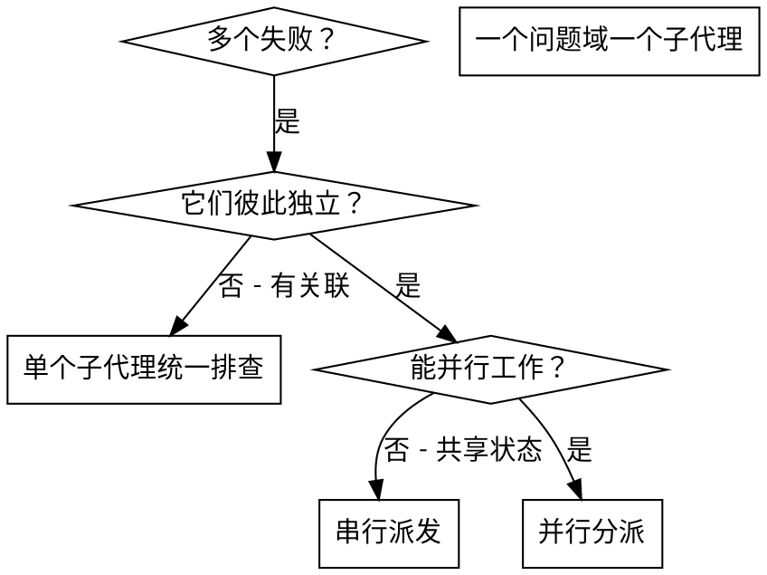

（中文补充：面对 2 个以上彼此独立、无共享状态、无先后依赖的任务时使用。）

# 并行分派子代理

## 概述

你把任务派给拥有隔离上下文的子代理。通过精确构造它们的指令与上下文，你能让它们保持聚焦并完成任务。它们绝不继承你所在会话的上下文或历史——你需要什么就构造什么。这同时保住了你自己的上下文用于协调工作。

当你面对多个互不相关的失败（不同测试文件、不同子系统、不同 bug）时，串行排查是在浪费时间。每项排查彼此独立，可以并行进行。

**核心原则：** 一个独立问题域派一个子代理，让它们并发工作。

## 何时使用



**适用：**
- 3 个以上测试文件失败，根因各不相同
- 多个子系统各自独立地坏掉
- 每个问题不需要其它问题的上下文就能理解
- 各项排查之间没有共享状态

**不适用：**
- 失败之间有关联（修一个可能顺带修好另一个）
- 需要理解整个系统的状态
- 子代理之间会互相干扰

## 模式

### 1. 识别独立问题域

按"坏的是什么"给失败分组：
- 文件 A 的测试：工具审批流程
- 文件 B 的测试：批处理完成行为
- 文件 C 的测试：中止功能

每个域都是独立的——修工具审批不会影响中止测试。

### 2. 构造聚焦的子代理任务

每个子代理拿到：
- **明确范围：** 一个测试文件或一个子系统
- **清晰目标：** 让这些测试通过
- **约束：** 不要改其它代码
- **期望产出：** 报告你发现了什么、改了什么

### 3. 并行分派

在**同一个主代理回合**里发出多个 `delegate_task` 调用——它们会并行运行：

```text
delegate_task(worker=1, role="implementation", project="/workspace/<git 仓库根>",
  context="修复 agent-tool-abort.test.ts 的失败：……（范围、约束、报告路径、产出要求）")
delegate_task(worker=2, role="implementation", project="/workspace/<git 仓库根>",
  context="修复 batch-completion-behavior.test.ts 的失败：……")
delegate_task(worker=3, role="implementation", project="/workspace/<git 仓库根>",
  context="修复 tool-approval-race-conditions.test.ts 的失败：……")
# 三个并发运行。
```

同一回合里多个 `delegate_task` 调用 = 并行执行；一个回合一个 = 串行。

Eta 上的分派规则：

- `worker` 取 1..6，是并发槽位；`role` 取 `research` / `implementation` / `review`。改代码用 `implementation`；只做只读调研用 `research`（research 子代理不能写文件）；只做审查用 `review`。
- `implementation` 子代理必须给 `project=/workspace/<git 仓库根>`：平台会自动为它建一个隔离的 git worktree，各改各的副本，不会互相踩文件。主代理不自己建、也不自己删 worktree。
- **子代理能力边界：** 任何子代理都只能 `read_file` / `list_directory`（`research`、`review` 不能执行 shell、GUI、浏览器）；`implementation` 只能写它自己 worktree 里的文件。**任何子代理都不能再派发子代理**，也不能执行命令、跑测试或提交。
- 命令与测试由主代理执行：用 `terminal(environment=linux)` 跑测试套件，把输出交给 `review` 子代理判定；`review` 子代理在给定 workspace 上只读检查。
- 不要指定模型：worker 由用户配置决定。

### 4. 审查与集成（必须用 `manage_agent_workspace` 收尾）

子代理返回后：

- 用 `get_task_result` 取每个子代理的结果；仍在运行、需要补上下文的用 `supervise_task(guide)` 直接给它补指令；被 pause 的用 `continue_task` 恢复；确定不需要的用 `cancel_task`。只有 `can_replace=true` 且执行已停止的失败任务才可用 `replace_task_id` 替换，且不得重复派发同一份工作。
- 读每份报告，但把报告当**未经验证的声明**：核对它声称改动的文件与真实内容。
- 用 `terminal` 跑覆盖的测试，把输出写成证据文件；再用 `manage_agent_workspace(inspect)` 看每个 workspace 改了什么、状态如何。
- 对每个有改动的 workspace，先派一个 `role="review"` 的子代理在该 `workspace_id` 上做只读核验（spec 合规 + 质量）。**merge 之前，必须已经有 review 子代理在该 workspace_id 上跑完并核验。**
- 用 `manage_agent_workspace` 逐个显式处理：能合并的 `merge`（fast-forward only，且不会自动 push），被取代或不该合的 `discard`。**留着不动不是收尾**——一个 workspace 都不能悬空。
- 多个并行分支逐个合并，每次合并后重跑受影响的测试。如果合并出现冲突，或两个"独立"域的语义其实重叠，那它们并不独立：退回串行排查。

## 子代理提示词结构

好的子代理提示词是：
1. **聚焦** —— 一个清晰的问题域
2. **自包含** —— 理解问题所需的全部上下文
3. **对产出有明确要求** —— 子代理应该返回什么？

```markdown
修复 src/agents/agent-tool-abort.test.ts 中 3 个失败的测试：

1. "should abort tool with partial output capture" - 期望消息里出现 'interrupted at'
2. "should handle mixed completed and aborted tools" - 快工具被中止而不是完成
3. "should properly track pendingToolCount" - 期望 3 个结果，实际得到 0

这些是时序/竞态问题。你的任务：

1. 读测试文件，弄清每个测试在验证什么
2. 定位根因——是时序问题还是真实 bug？
3. 按以下方式修复：
   - 把任意超时替换成基于事件的等待
   - 若发现中止实现里的 bug，修掉它
   - 若测试期望本身在测已经变化的行为，调整期望

不要只是加大超时——找出真正的问题。

约束：只改这个测试文件与它直接依赖的实现文件；不要动其它子系统，不要顺手重构。

你不执行任何命令：不跑测试、不用 git、不提交、不派发子代理。测试由主代理执行，
结果会交给审查者。

把完整报告写进 [报告文件路径]：你找到的根因、改动的文件、设计上的取舍、你的顾虑。
然后只回复：状态行（DONE | DONE_WITH_CONCERNS | BLOCKED | NEEDS_CONTEXT）+ 报告文件路径。
```

## 常见错误

**❌ 太宽：** "修所有测试" —— 子代理会迷失
**✅ 具体：** "修 agent-tool-abort.test.ts" —— 范围聚焦

**❌ 没有上下文：** "修这个竞态" —— 子代理不知道在哪
**✅ 有上下文：** 把错误消息与测试名贴进去

**❌ 没有约束：** 子代理可能把一切都重构了
**✅ 有约束：** "不要改生产代码" 或 "只修测试"

**❌ 产出要求含糊：** "修好它" —— 你不知道改了什么
**✅ 产出具体：** "返回根因与改动的摘要"

**❌ 要求子代理自己验证：** "跑一遍测试确认通过" —— 子代理没有执行能力
**✅ 验证归主代理：** 让子代理写报告，测试由主代理用 `terminal` 跑，`review` 子代理只读核验

## 何时不要用

**有关联的失败：** 修一个可能顺带修好另一个——先一起排查
**需要完整上下文：** 理解问题需要看到整个系统
**探索性调试：** 你还不知道坏在哪
**共享状态：** 子代理会互相干扰（改同一批文件、用同一份资源）

## 真实会话案例

**场景：** 一次大重构之后，3 个文件里共 6 个测试失败

**失败：**
- agent-tool-abort.test.ts：3 个失败（时序问题）
- batch-completion-behavior.test.ts：2 个失败（工具没有执行）
- tool-approval-race-conditions.test.ts：1 个失败（执行计数 = 0）

**判断：** 三个独立域——中止逻辑、批处理完成、竞态条件彼此独立

**分派：**
```text
worker=1 (implementation) → 修 agent-tool-abort.test.ts
worker=2 (implementation) → 修 batch-completion-behavior.test.ts
worker=3 (implementation) → 修 tool-approval-race-conditions.test.ts
```

**结果：**
- worker 1：把超时换成基于事件的等待
- worker 2：修了事件结构 bug（threadId 放错了位置）
- worker 3：补上了对异步工具执行完成的等待

**集成：** 三处改动互不重叠；主代理用 `terminal` 跑完整套件通过；逐个 `manage_agent_workspace(inspect)` 后用 `merge` 合并，没有 workspace 悬空。

## 验证

子代理返回后：
1. **读每份报告** —— 弄清改了什么（报告是声明，不是证据）
2. **检查冲突** —— 子代理是否改了同一处代码
3. **主代理用 `terminal` 跑完整套件** —— 验证所有修复能一起工作
4. **抽查** —— 子代理会犯系统性错误
5. **收尾 workspace** —— 每个都 `merge` 或 `discard`，不能留在原地不管
