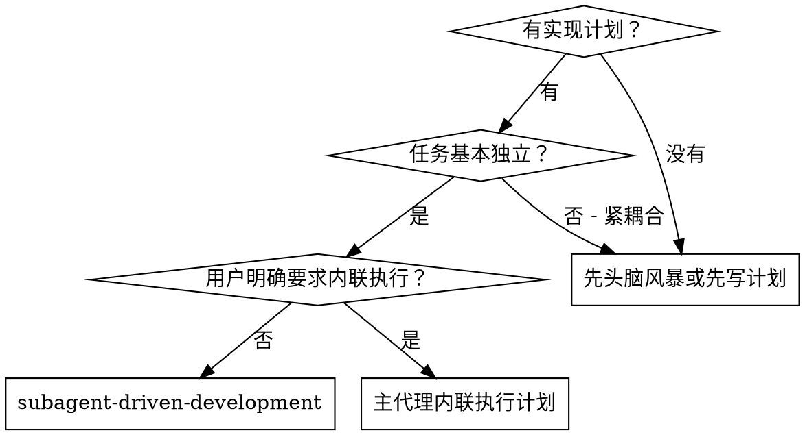
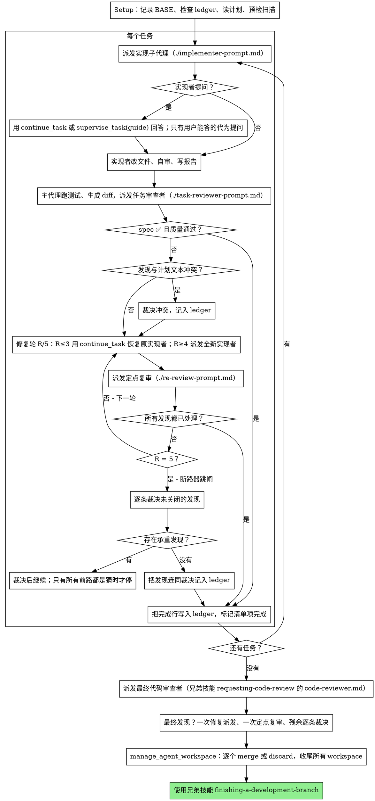

（中文补充：在当前会话里执行由多个基本独立的实现任务组成的计划时使用。）

# 子代理驱动的开发

按任务派发一个全新的实现（implementation）子代理，每个任务后做一次任务审查（spec 合规 + 代码质量），最后做一次覆盖整体改动的广泛审查。

**为什么要用子代理：** 你把任务派给拥有隔离上下文的子代理。通过精确构造它们的指令与上下文，你能让它们保持聚焦并完成任务。它们绝不继承你所在会话的上下文或历史——你需要什么就构造什么。这同时保住了你自己的上下文用于协调工作。

**核心原则：** 每个任务一个全新子代理 + 任务审查（spec + 质量）+ 最终的广泛审查 = 高质量、快速迭代

**旁白：** 工具调用之间最多写一行短句说明——记录由 ledger 与工具结果承担。

**连续执行：** 不要在任务之间停下来跟用户确认。把计划里的任务全部执行完。只有下面四类情形、或全部任务完成，才停。"要不要继续？"式的提问与进度汇报是在浪费用户的时间——他们让你执行计划，那就执行。

**给裁决，不要卡住。** 运行中的计划不等人。冲突、含糊、计划缺陷、你本来想问用户能不能超的上限——都由你决定。spec 是约束性权威，计划是它的论证，两者都没回答的部分由你的判断落定。每个决定都记入 ledger：`Ruling: <你决定了什么> — <为什么> — <错了的代价>`，然后继续。一次错误的裁决，代价是用户看得见、能撤销的返工；一个卡在问题上的会话，代价是用户一整天，而且什么都换不来。

只有四件事让你停下：不可逆或破坏性操作；安全敏感操作；在本工作区之外、按惯例应先问用户的副作用（合并回目标分支、推送到共享分支、发布）；以及计划烂到每一条前路都是猜。这些情形停下并问。

## 何时使用



**对比内联执行计划：**
- 每个任务一个全新子代理（无上下文污染），而不是一个上下文做完所有任务
- 每个任务后都审查（spec 合规 + 代码质量），而不是只在最后审一次
- 代价是每个任务、每次审查各要一个全新上下文；内联的代价是一个上下文加一个最终审查者
- 两者都在当前会话里跑，共享同一份计划 scratch 与 ledger，且都不在任务之间停顿

## 流程



## Setup

实现工作必须发生在隔离工作区里：**平台会为每个 implementation 子代理自动创建一个隔离的 git worktree**（派发时必须给 `project=/workspace/<git 仓库根>`）。主代理不自己建、也不自己删 worktree；它在收尾时用 `manage_agent_workspace(list/inspect/merge/discard)` 显式处理每一个 workspace。merge 是 fast-forward only，且不会自动 push。merge 之前，必须已经有 `review` 子代理在该 workspace_id 上跑完并核验。

绝不在用户的 main/master 上直接开工。把改动合并回目标分支属于"本工作区之外的副作用"，是要先停下来问用户的那一类，由用户在收尾时决定。

会话记忆撑不过压缩。真实会话里，失去位置的控制器曾把整段已完成的任务重新派发一遍——这是观察到的代价最高的失败。用 ledger 文件跟踪进度，不要只靠回复里的清单。

- 每份计划一个 scratch 目录：`<repo-root>/.sdd-scratch/<plan-basename>/`（只是仓库内的普通临时目录，不是平台功能），本计划的全部临时产物放这里：ledger、brief、报告副本、diff 包、测试输出。主代理用 `write_file` 创建目录与文件，并在 `<repo-root>/.sdd-scratch/.gitignore` 里写一行 `*`，让这些临时产物不进 `git status`、不被误提交。别的计划的目录永远不归你读写。
- 检查本计划的 ledger：`<scratch>/progress.md`。如果它的第一行指名了你这份计划文件，带 `Task <N>: complete` 行的任务就是 DONE——不要重新派发，从第一个没有该行的任务继续。最后一行是修复轮的任务处在循环中间：从下一轮继续。第一行指向另一份计划文件的 ledger 属于别的计划：原地留着，另起你自己的。
- ledger 第一行写身份：`# SDD ledger — plan: <计划文件路径>`。
- ledger 是你的恢复地图：它记录的 workspace、产物与状态即使在你的上下文不再记得时也真实存在。压缩之后，信任 ledger 与主代理用 `terminal` 查到的实际状态，而不是自己的记忆。
- 派发第一个任务之前，用 `terminal` 记录 BASE（仓库当前 HEAD）——生成 diff 与定点复审都要用它。
- scratch 目录是临时产物，不是交付物；但在 rulings 汇总进最终消息之前，不要清理它。

读一遍计划，记下它的上下文与 Global Constraints，并为每个任务建一条编号清单项（Eta 没有 todo 工具，清单写在主代理回复里，随进度更新）。如果计划指名了 Spec，也读它：spec 是计划据以论证的权威，计划内部的冲突按 spec 裁决。计划找不到可达的 spec，就在 ledger 里记一句：在没有 spec 的情况下做出的裁决都是暂定的。

在派发 Task 1 之前，把计划扫一遍找冲突，边扫边写下你检查了什么：

- 任务之间、任务与计划 Global Constraints 之间互相矛盾的地方
- 计划明确要求、但审查标准会判为缺陷的东西（什么都不断言的测试、逐字复制的逻辑块）

扫描的产出是一张表，不是一个结论。所有共享文件或接口的任务对都要有一行：两个任务分别是什么、一个产出什么、另一个消费什么、你发现了什么。每个任务都要有一行：它自己的文本是否自洽——它规定的测试与它规定的代码、它新建的文件与它后续改动的文件。"扫描干净"而没有这些行，等于你没做扫描。

把这张表写进 ledger。执行开始前对你发现的每一处做出裁决——每一处都对照要求它的计划文本——并把每条裁决记入 ledger。扫描干净就直接开始，不必多言。对扫描暴露的冲突逐条裁决——spec 是约束性权威，计划是它的论证——把裁决记在对应行旁边，然后派发 Task 1。审查循环仍然是"只有实现过程中才浮现"的冲突的兜底。

## 角色与 worker 的选择

**不做模型选择。** Eta 上 worker 由用户配置决定：主代理只选 `role` 与空闲的 `worker` 槽位（1..6），不指定、不猜测任何模型档位，也不存在"更贵的档位"这种升级手段。

- `role="implementation"`：写代码、改文件。必须给 `project=/workspace/<git 仓库根>`，平台据此自动建隔离 worktree。
- `role="review"`：只读审查。给它 `workspace_id`、brief、报告、diff 文件与测试输出文件的路径。
- `role="research"`：只读调研，不写文件。

选的是"这个任务需要哪类角色"，不是"用多强的模型"。任务复杂度信号仍然有用——它决定你要在派发里补多少上下文、要不要把任务拆小：

- 只碰 1-2 个文件、spec 完整 → 直接派发，brief 里带全确切取值
- 碰多个文件、有集成关系 → 派发里补齐跨任务接口与已定决策
- 需要设计判断或较广的代码库理解 → 先把设计判断在计划或裁决里定下来再派发，不要让实现者去猜

## The Task Loop

**批量处理小而同形的工作。** 计划里如果列出若干彼此独立、形状相同的小改动——同一处一行修复、同一个常量替换、同一个字段添加，重复在不同文件里——不要一个任务派一个子代理。把它们合成一份派发内容，列出每个文件与它的改动，整批交给一个子代理，把它的改动当一个整体审查。只有需要自己的判断、自己的测试或自己的审查面的工作，才一个任务一次派发。

你粘进派发内容的每一样东西——以及子代理回给你的每一样东西——都会在会话剩余时间里常驻你的上下文，并在之后的每一轮被重新读一遍。所以产物要以文件形式交接：brief 写文件、报告写文件、diff 写文件、测试输出写文件，路径互相传递。

**等待被派发的子代理：** 不要为了等结果而空转查询。还有本地工作（更新 ledger、准备下一个审查材料、读报告）就继续做。确实空闲时，用 `get_task_result` 查询运行中的子代理；子代理卡住或需要补上下文时，用 `supervise_task(guide)` 给运行中的它补指令；被 pause 的用 `continue_task` 恢复；确定不需要的用 `cancel_task` 真取消。一个失败任务只有在其 `can_replace=true` 且执行已经停止时，才能用 `replace_task_id` 替换——而且不得把同一份工作重复派发两次。一个卡住或失联的子代理，必须在几分钟内被发现，而不是等到会话末尾。

### 1. 派发实现者

派发前用 `terminal` 记录 BASE（仓库当前 HEAD）——diff 与定点复审都要用它。

- **任务 brief：** 派发实现者之前，主代理用 `write_file` 把该任务的完整文本写到本计划的 scratch 目录：`<scratch>/task-N-brief.md`。派发要让 brief 成为需求的唯一来源。派发内容应包含：(1) 一行说明这个任务在项目里的位置；(2) brief 路径，并注明"先读这个——它就是你的需求，里面的确切取值要照抄"；(3) brief 不可能知道的、来自前序任务的接口与决策；(4) 你对 brief 中含糊处的裁决；(5) 报告文件路径与报告契约。确切取值（数字、魔法字符串、签名、测试用例）只出现在 brief 里。绝不让子代理去读整份计划文件。
- **报告文件：** 报告文件与 brief 同名对应（brief `…/task-N-brief.md` → 报告 `…/task-N-report.md`），路径放进派发内容。报告文件要落在该子代理**自己的隔离 worktree 内**（它只能写自己 worktree 里的文件）；主代理随后用 `read_file` 读它，并可用 `terminal` 把它复制进本计划的 scratch 目录。实现者把完整报告写在那里，只回状态、改动文件、一行自审摘要与顾虑。若它确实写不出文件，退回"把报告正文放进最终回复"，主代理收到后自己用 `write_file` 存进 scratch 目录。
- 派发内容描述的是一个任务，不是会话历史。不要把累积的前序任务摘要（"Task 1-3 之后的状态"）粘进后续派发——真实会话里有一次派发 42k 字符，其中 99% 是粘贴的历史。全新子代理需要的是：它的任务、它要碰的接口、全局约束。别的都不要。
- 派发要带上"不派发子代理"的契约（模板里有）：**实现者永不派发子代理**——不派帮手，更不派审查者。审查由你在报告之后安排。真实会话里，worker 自己生成的每个审查者都重复了你本来就会派的任务审查——每个任务白多一个审查席位。
- 如果更早的任务在本任务触及的区域留下了已 park 的发现，在派发里带上那条 ledger 记录的指针。
- 从派发结果里记下该实现者的 agent 身份与 `workspace_id`——修复轮 1-3 要用它恢复，收尾要用它 merge 或 discard。
- **绝不并行派发多个 implementation 子代理**（会冲突）。

模板：[implementer-prompt.md](implementer-prompt.md)

### 2. 处理报告

实现者子代理报四种状态之一。每种都按对应方式处理：

**DONE：** 主代理先用 `terminal` 在该 workspace 上跑覆盖本任务的测试，把输出写成证据文件；再用 `terminal` 在该 workspace 上对记录的 BASE 生成 diff 文件（提交列表、stat 摘要、带上下文的完整 diff）。然后带着这些路径派发任务审查者。BASE 必须是你派发实现者之前记录的那个提交——绝不用 `HEAD~1`，它会悄悄截断多提交的改动范围。

**DONE_WITH_CONCERNS：** 实现者完成了工作但标了疑虑。先读这些疑虑再往下走。如果疑虑关乎正确性或范围，先处理再进入审查；如果只是观察（例如"这个文件在变大"），记下来，继续审查。

**NEEDS_CONTEXT：** 实现者需要没提供的信息。若它还在运行，用 `supervise_task(guide)` 直接补；若它已停，用 `continue_task` 恢复并补上下文；若无法再给这个子代理发消息，就把缺失上下文写进派发内容，派发一个新的 implementation 子代理。只有用户能回答的问题，由主代理在自己的回复里代为提问。

**BLOCKED：** 实现者无法完成任务。评估阻塞点：
1. 若是上下文问题，补上下文后用 `continue_task` 恢复同一个子代理
2. 若任务需要更强的推理，先把设计判断裁决清楚、或把任务拆小，再派发
3. 若任务太大，拆成更小的任务
4. 若计划本身是错的，裁决修正方案、记入 ledger，并把裁决带进下一次派发

**绝不**忽视一次升级，也绝不让同一个子代理在什么都不变的情况下重试。实现者说它卡住了，那就得有东西改变。若该失败任务 `can_replace=true` 且执行已停止，可以用 `replace_task_id` 替换它；否则用 `continue_task` 恢复，或派发新的 worker——但不得重复派发同一份工作。

实现者在开工前或任务中途提问时——把答案清楚地、完整地给它（运行中用 `supervise_task(guide)`，已停用 `continue_task`），需要就补上下文，不要催它直接开工。只有用户能回答的问题，由主代理代为提问，或在自己的回复里直接问用户。

### 3. 审查任务

每个任务的审查是任务级的门。广泛审查在所有任务完成后只做一次。**绝不跳过任务审查**，也绝不接受缺少任何一个判定的报告——spec 合规**和**任务质量两者都必须有。实现者的自审永远不能替代任务审查；两者都要。

- 把 diff 作为文件交给审查者：主代理用 `terminal` 在该子代理的 workspace 上生成 diff 文件（提交列表、stat 摘要、带上下文的完整 diff），把文件路径交给审查者；或者让审查者直接在该 `workspace_id` 上只读检查。输出不进入你自己的上下文，审查者一次读取就能看到提交列表、stat 摘要与完整 diff。用你派发实现者之前记录的 BASE——绝不用 `HEAD~1`。**绝不在没有 diff 文件或明确 workspace 引用的情况下派发任务审查者。**
- **审查者输入：** 同一份 brief 文件、报告文件、diff 文件路径、该子代理的 `workspace_id`、主代理跑出的测试输出文件，以及约束本任务的全局约束。
- 你交给审查者的全局约束块是它的注意力透镜。从计划的 Global Constraints 段或 spec 里逐字复制约束性要求：确切取值、确切格式，以及组件之间被明确声明的关系（"和 X 一样的布局"、"与 Y 匹配"）。审查者模板本身已经带了流程规则（YAGNI、测试卫生、审查方法）——约束块是给"这个项目的 spec 要求什么"用的。
- 不要加"检查所有使用处""如果有用就跑竞态测试"这类开放式指令，除非有具体且与本任务相关的理由
- 不要让审查者重跑实现者已经跑过的测试：子代理不执行命令，测试证据是主代理用 `terminal` 跑出来的。把测试输出文件路径给它，让它对照 diff 判定。
- 不要替审查者预判发现——绝不要指示审查者忽略或不许标记某个具体问题。如果你认为某条发现会是误报，让审查者提出来，在审查循环里裁决。如果你正在写的提示词里出现"不要标记""别把 X 当缺陷""最多算 Minor""计划就是这么选的"——停下：你在预判，通常是为了给自己省一轮审查。

任务审查者可能报出"⚠️ 无法从 diff 验证"的条目——那些要求落在未改动的代码里，或跨任务。它们不阻塞审查的其余部分，但**你必须在标记任务完成之前逐条自行解决**：你持有审查者没有的计划与跨任务上下文。确认某条是真缺口，就当作一次 spec 审查失败——它和其他发现一起进入修复循环。

模板：[task-reviewer-prompt.md](task-reviewer-prompt.md)

### 4. 修复循环

当审查报出 spec ❌、任何 Critical 或 Important 发现、或一条你确认属实的 ⚠️ 条目时，循环启动。

循环开始前，有两条路线立刻离开它：

- Minor 发现边做边记进 ledger（`Task <N>: minor (deferred): <一句话>`），并在最终整体审查里指向那份清单，让它分诊哪些必须在合并前修掉。没人看的汇总等于静默丢弃。Minor 发现永不进入循环。
- 标为 plan-mandated 的发现——或任何与计划文本要求相冲突的发现——归你裁决：把发现与计划文本放在一起权衡，以 spec 作为约束性权威来定，并在行动之前把裁决记入 ledger。不要因为计划要求它就驳回这条发现，也不要在没有记录裁决的情况下派发一个与计划相矛盾的修复。

其余一切都进入循环。一个修复轮 = 一次修复派发 + 一次定点复审。每个任务最多五轮：

**第 1-3 轮 —— 恢复原实现者。** 把未关闭的发现逐字发给它：它还在运行就用 `supervise_task(guide)`，已停就用 `continue_task` 恢复。它的上下文还在：它知道任务、代码和自己的选择。若无法再给该子代理发消息，就派发一个全新的实现者，带上 brief 路径、报告文件路径与发现——报告文件在两种情况下都是持久记忆。

**第 4-5 轮 —— 派发一个全新的实现者**（worker 由用户配置决定），带上 brief 路径、报告文件路径、未关闭的发现，以及这段话术："此前已有实现者尝试过这个任务 [N] 次；现在归你。先读报告文件了解试过什么。" 撑过三次恢复的循环通常意味着实现者看不见自己的问题——换一双眼睛。

**每一轮都一样：** 实现者改文件、把修复报告追加到同一份报告文件、返回简短契约。主代理随后用 `terminal` 重跑覆盖被改动代码的测试，把输出写成文件交给复审者。派发复审之前，先确认修复报告点明了覆盖的测试文件、写清了改了什么，并且测试输出文件存在；三者齐了再派发复审。在修复指令里点名覆盖的测试文件——一行改动不需要整套测试。

**复审是定点的。** 主代理在该 workspace 上对"上一次审查看到的 head"生成 diff 文件，把 [re-review-prompt.md](re-review-prompt.md) 连同发现清单、brief、报告文件与 diff 路径一起派发。复审者逐条判定 ADDRESSED / NOT ADDRESSED，并且只在修复 diff 内标出新破坏。修复 diff 里新的 Critical/Important 破坏加入未关闭发现清单。范围外的观察记入 ledger 作为延后 minor——它们绝不延长循环。

**每轮之后**在 ledger 追加：
`Task <N>: fix round <R>/5 (<X> addressed, <Y> open — <发现一句话>; workspace <workspace_id>)`

绝不在控制器会话里自己修发现——你的上下文要保持干净用于协调，而且控制器直接改会绕过审查。

**断路器。** 第 5 轮复审后仍有未关闭发现时，停止派发。自己逐条裁决——你持有审查者没有的计划与跨任务上下文：

- **审查者错了，或这条本身有争议：** park 它——`Task <N>: parked — <发现> — Ruling: <为什么代码这样是对的>`。最终审查会同时看到双方。
- **属实，但下游没有任何东西建立在它上面：** 同样 park，裁决里写明它属实但被延后。
- **属实且承重**——后面的任务建立在它上面，或它暴露了一个计划缺陷：对"能解锁依赖工作的最小改动"做出裁决，记为 `Task <N>: Ruling: <发现> — <你决定了什么、为什么>`，并带进下一个任务的派发。静默 park 一个结构性失败，会让每个依赖它的任务都建在它上面。只有当这个缺陷让每一条前路都成为猜时，才停下。

只在到达上限时裁决。为了结束循环而提前裁决，是换了个名字的预判。每次裁决都是一条 ledger 记录——静默丢弃是禁止的。

### 5. 完成任务

审查干净返回时——或到达上限后每个未关闭发现都连裁决一起 park 之后——在与其他记账同一条消息里把完成行追加进 ledger：

- `Task <N>: complete (workspace <workspace_id>, review clean)`
- `Task <N>: complete (workspace <workspace_id>, <K> parked)`（断路器跳闸之后）

然后标记清单项完成并继续。只要审查还有未修复、也未在上限处连裁决一起 park 的 Critical/Important 问题，就绝不进入下一个任务。

## 最终审查

最终的整体审查也要有材料包：主代理在该 workspace 上对 `MERGE_BASE`（这次工作开始时的提交，例如用 `terminal` 跑 `git merge-base main HEAD` 得到的那个提交）生成 diff 文件，并把路径放进最终审查的派发里，让最终审查者读一个文件而不是自己用 git 命令重新推导分支 diff。派发一个 `role="review"` 的子代理（worker 由用户配置决定），使用兄弟技能 requesting-code-review 的 [code-reviewer.md](../requesting-code-review/code-reviewer.md)。把它指向 ledger 里的延后 minor 与 parked 行，让它分诊哪些必须在合并前修掉。

如果最终整体审查返回发现，只派发**一次**修复子代理，带上完整发现清单——不是一个发现一个修复者。一个发现一个修复者会各自重建上下文、各自重跑测试；真实会话里最终审查的这一波修复，代价超过它前面所有任务之和。然后对这次修复波次做恰好**一次**定点复审（对该修复范围生成 diff 文件，用 [re-review-prompt.md](re-review-prompt.md)）。残余发现按任务循环里的断路器裁决：能 park 的连裁决一起 park，承重的裁决并记下你决定了什么。这里仍然只有上面那四类情形让你停下。**没有第二轮修复波次**——残余的承重发现会在 finishing-a-development-branch 呈现选项时浮到用户面前。

## Finish

在你清理任何东西之前，先把 ledger 里所有含 `Ruling:` 的行——预检裁决、parked 发现、断路器裁决，全部——按你做出它们的顺序收进最终消息的"我做过的裁决"一节，每条都写上错了的代价。这份清单必须是穷尽的：ledger 里有一条裁决，清单里就有一条。这是你替用户做的决定唯一能到达用户的地方——他们会读它，并返工你判断错的部分。一条随 scratch 目录消失的裁决，等于一次秘密决定。

当最终整体审查干净、它的修复已经落地之后，用 `manage_agent_workspace(list/inspect)` 过一遍所有 workspace，再逐个显式收尾：该合的用 `merge` 合并回目标分支（fast-forward only，且不会自动 push），被取代或不该合的用 `discard`。**一个 workspace 都不能悬空：留着不动不是收尾。** 别的计划的目录与 workspace 归别人，不要动。

合并时机由用户在收尾时决定，因为合并是"本工作区之外的副作用"：可以在最终审查通过后一次性处理，也可以在用户明确授权后按任务顺序逐个处理（merge 是 fast-forward only，按 worktree 的创建顺序逐个合并才可能直接成功）。若某个 workspace 无法 fast-forward 合并，不要硬来、不要假装成功，也不要把它留成悬空——把冲突如实报给用户，由用户决定怎么处理。

然后使用兄弟技能 finishing-a-development-branch。**收尾必须给出明确的下一步处置**——合并到目标分支，或者输出补丁与提交信息交给用户处理（本机没有 gh，也没有 PR 流程，不要假装有）。把"分支保留、什么都不做"当作终点是不合法的：那样改动既没进主线，也没交到用户手里。

## Common Rationalizations

| 借口 | 现实 |
|--------|---------|
| "spec 合规上算差不多了" | 审查者发现 spec 缺口 = 没完成。修掉，或撞到上限后裁决——这是仅有的两个出口。 |
| "我自己修吧，派发太麻烦" | 控制器直接修会污染你的上下文，并且绕过审查。恢复实现者。 |
| "再来一轮就会收敛" | 过了上限，轮次不会收敛——失败是结构性的。裁决并改道。 |
| "反正审查者总会挑出新问题" | 定点复审只验证修复，不能乱逛。未改动代码上的新发现进 ledger，不进循环。 |
| "这条发现明显是错的，我直接丢掉" | 你只在上限处裁决，且每条裁决都是 ledger 记录。静默丢弃是禁止的。 |
| "改动很小，复审就免了" | 没被审查的修复正是回归落地的途径。每一轮都以一次定点复审收尾。 |
| "审查拖慢了循环" | 没有审查的循环只是未经核实的瞎忙。审查是循环的刹车和方向盘。 |
| "维护 ledger 是额外开销" | ledger 是撑过压缩的东西。没有 ledger 的控制器把整段已完成的任务重新派发过。 |
| "实现者自己拉了个审查者——白捡的额外保障" | 那是一个重复席位，审的还是同一份 diff；任务审查才是那道门。worker 自己派审查者是必须标记的缺陷，不是严谨。 |

## Example Workflow

```text
你：我用 Subagent-Driven Development 执行这份计划。

[Setup：用 terminal 记录 BASE；读计划文件 docs/plans/feature-plan.md；
 检查 scratch 目录 <repo-root>/.sdd-scratch/feature-plan/progress.md —— 没有 ledger，全新开始]
[为所有任务建编号清单项]

Task 1: Hook 安装脚本

[用 write_file 写出 task-1-brief.md；delegate_task(worker=1, role="implementation",
 project="/workspace/<repo>", context=brief 路径 + 报告路径 + 接口上下文)]
[记录该子代理的 workspace_id]

实现者：NEEDS_CONTEXT —— "开工前确认：hook 装到用户级还是系统级？"

你：continue_task 回答"装在项目内的约定目录"，恢复该任务。

实现者（随后）：
  - 实现了 install-hook 命令
  - 补了测试用例，自审时发现漏了 --force 标志，已补上
  - 报告已写入 task-1-report.md
  - Status: DONE

[用 terminal 在 workspace 上跑覆盖测试，输出写成 task-1-tests.txt；
 用 terminal 对该 workspace 生成 diff 文件 task-1.diff；
 delegate_task(worker=2, role="review", context=brief + 报告 + diff + 测试输出 + workspace_id)]

任务审查者：Spec ✅ —— 所有要求都满足，没有多做。
  亮点：测试覆盖好、代码干净。问题：无。任务质量：Approved。

[用 manage_agent_workspace(inspect) 看这个 workspace，确认无冲突；合并留到收尾时处理]
[ledger: Task 1: complete (workspace ws-1, review clean)]

Task 2: 恢复模式

[用 write_file 写出 task-2-brief.md；delegate_task(worker=1, role="implementation",
 project="/workspace/<repo>", context=...)；记录新的 workspace_id]

实现者：[没有提问]
  - 加了 verify/repair 两种模式
  - 自审：报告了 100 这个魔法数字
  - Status: DONE_WITH_CONCERNS

[主代理跑测试并生成 diff；派发任务审查者（worker=2, role="review"）]
任务审查者：Spec ❌：
  - 缺失：进度上报（spec 说"每 100 项报一次"）
  问题（Important）：魔法数字（100）

[修复轮 1：continue_task 恢复该实现者，附上两条发现]
实现者：补了进度上报，抽出 PROGRESS_INTERVAL 常量。修复报告已追加。

[主代理重跑 test/recovery.test.js，输出写成文件；生成修复 diff；派发定点复审]
复审者：缺少进度上报 —— ADDRESSED（src/recovery.js:41）。
  魔法数字 —— ADDRESSED（src/recovery.js:7）。新破坏：无。
  判定：所有发现已处理。

[ledger: Task 2: fix round 1/5 (2 addressed, 0 open; workspace ws-2)]
[ledger: Task 2: complete (workspace ws-2, review clean)]
[用 manage_agent_workspace(inspect) 确认状态]

...

[所有任务之后]
[生成 MERGE_BASE..HEAD 的 diff 文件；派发 role="review" 的最终代码审查者，
 使用兄弟技能 requesting-code-review 的 code-reviewer.md]
最终审查者：所有要求都满足。延后 minor 分诊：没有阻塞合并的。

[收尾：用 manage_agent_workspace(list/inspect) 过一遍，再逐个 merge（fast-forward only）
 或 discard——合并时机按用户在收尾时的决定；没有 workspace 悬空]
[把 ledger 里所有 Ruling: 行汇总进"我做过的裁决"一节，随最终消息给出]

完成！接下来用兄弟技能 finishing-a-development-branch 给出收尾选项。
```
