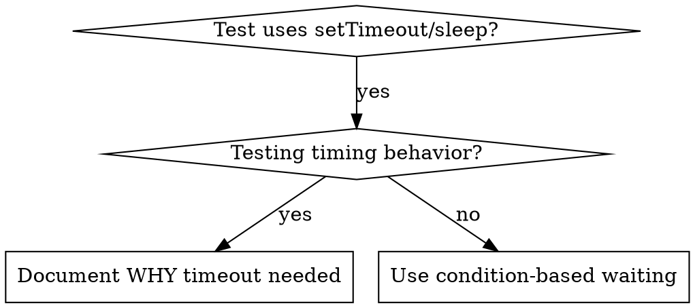

# Condition-Based Waiting（基于条件的等待）

## Overview（概述）

不稳定的测试常常用任意延时去猜时序。这会制造竞态：测试在快机器上通过，但在负载下或 CI 里失败。

**核心原则：** 等待你真正关心的那个条件，而不是猜它要花多久。

## When to Use（何时使用）



**在这些时候使用：**
- 测试里有任意延时（`setTimeout`、`sleep`、`time.sleep()`）
- 测试不稳定（有时通过，负载下失败）
- 并行运行时测试超时
- 等待异步操作完成

**不要在这些时候使用：**
- 测试真正的时序行为（防抖、节流间隔）
- 如果确实要用任意超时，永远要写明 WHY

## Core Pattern（核心模式）

```typescript
// ❌ 之前：猜时序
await new Promise(r => setTimeout(r, 50));
const result = getResult();
expect(result).toBeDefined();

// ✅ 之后：等待条件
await waitFor(() => getResult() !== undefined);
const result = getResult();
expect(result).toBeDefined();
```

## Quick Patterns（速查模式）

| 场景 | 模式 |
|----------|---------|
| 等待事件 | `waitFor(() => events.find(e => e.type === 'DONE'))` |
| 等待状态 | `waitFor(() => machine.state === 'ready')` |
| 等待数量 | `waitFor(() => items.length >= 5)` |
| 等待文件 | `waitFor(() => 文件存在检查(path))` |
| 复合条件 | `waitFor(() => obj.ready && obj.value > 10)` |

## Implementation（实现）

通用轮询函数：
```typescript
function waitFor(
  condition: () => T | undefined | null | false,
  description: string,
  timeoutMs = 5000
): Promise<T> {
  const startTime = Date.now();

  while (true) {
    const result = condition();
    if (result) return result;

    if (Date.now() - startTime > timeoutMs) {
      throw new Error(`Timeout waiting for ${description} after ${timeoutMs}ms`);
    }

    await new Promise(r => setTimeout(r, 10)); // 每 10ms 轮询一次
  }
}
```

按需要给上面的 `waitFor` 加上领域专用的辅助函数（例如 `waitForEvent`、`waitForEventCount`、`waitForEventMatch`），把"等待某类事件/某个数量/满足某谓词的事件"这类常见需求封装起来。

## Common Mistakes（常见错误）

**❌ 轮询太快：** `setTimeout(check, 1)` —— 浪费 CPU
**✅ 修法：** 每 10ms 轮询一次

**❌ 没有超时：** 条件永远不满足就死循环
**✅ 修法：** 永远带上超时和清晰的错误信息

**❌ 陈旧数据：** 在循环前缓存状态
**✅ 修法：** 在循环内部调用 getter 拿最新数据

## When Arbitrary Timeout IS Correct（何时任意超时是对的）

```typescript
// 工具每 100ms 跳一次 —— 需要 2 跳才能验证部分输出
await waitForEvent(manager, 'TOOL_STARTED'); // 先：等待条件
await new Promise(r => setTimeout(r, 200));   // 再：等待计时行为
// 200ms = 100ms 间隔的 2 跳 —— 有记录、有依据
```

**要求：**
1. 先等待触发条件
2. 基于已知时序（不是猜测）
3. 用注释解释 WHY

## Real-World Impact（真实影响）

来自一次调试会话（2025-10-03）：
- 修好了 3 个文件里的 15 个不稳定测试
- 通过率：60% → 100%
- 执行时间：快了 40%
- 不再有竞态
