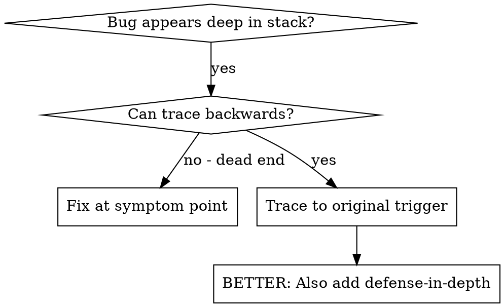
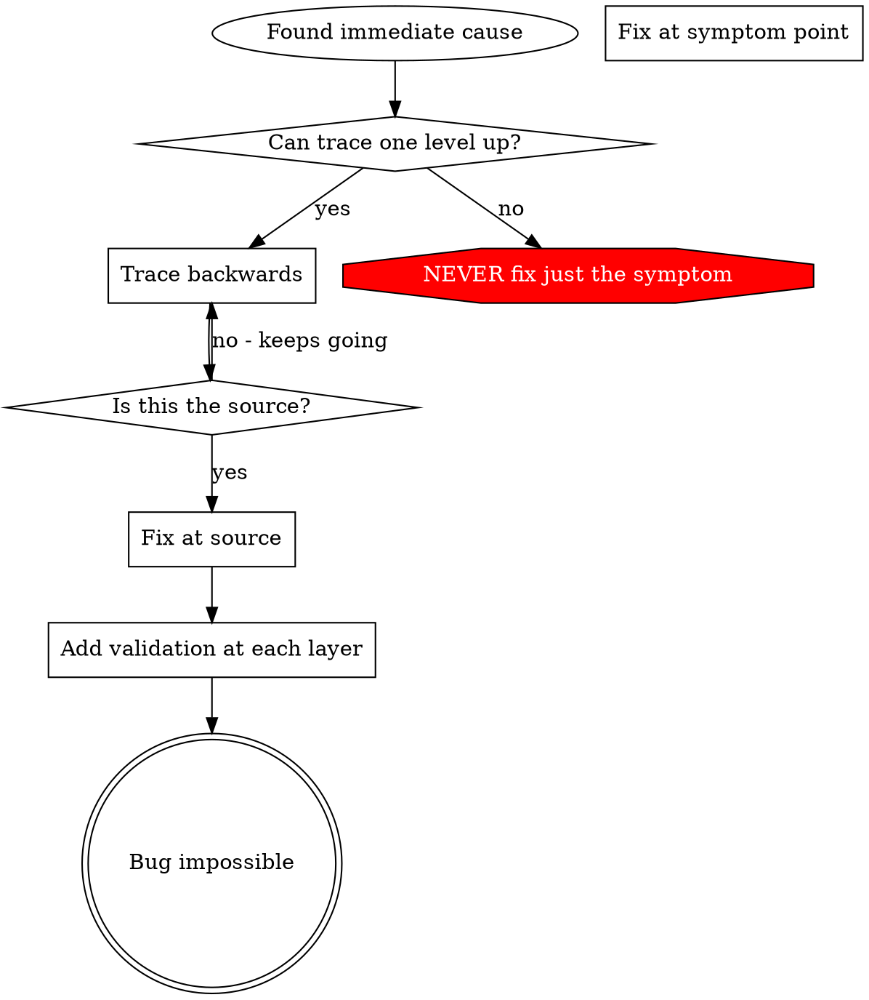

# Root Cause Tracing（根因追踪）

## Overview（概述）

Bug 常常在调用栈深处显现（在错误的目录里 `git init`、文件创建到错误的位置、用错误路径打开数据库）。你的直觉是在错误出现的地方修，但那是治症状。

**核心原则：** 沿调用链向后追踪，直到找到最初的触发点，然后在源头修。

## When to Use（何时使用）



**在这些时候使用：**
- 错误发生在执行深处（不在入口点）
- 栈追踪显示很长的调用链
- 不清楚非法数据从哪来
- 需要找出是哪个测试/哪段代码触发了问题

## The Tracing Process（追踪流程）

### 1. 观察症状
```
Error: git init failed in ~/project/packages/core
```

### 2. 找到直接原因
**哪段代码直接导致了这个？**
```typescript
运行 git init（cwd = projectDir）
```

### 3. 问：谁调用了它？
```typescript
WorktreeManager.createSessionWorktree(projectDir, sessionId)
  → called by Session.initializeWorkspace()
  → called by Session.create()
  → called by test at Project.create()
```

### 4. 继续往上追
**传进去的是什么值？**
- `projectDir = ''`（空字符串！）
- 空字符串作为 `cwd` 会解析到 `process.cwd()`
- 那就是源码目录！

### 5. 找到最初的触发点
**空字符串从哪来？**
```typescript
const context = setupCoreTest(); // 返回 { tempDir: '' }
Project.create('name', context.tempDir); // 在 beforeEach 之前就访问了！
```

## Adding Stack Traces（加入栈追踪）

当你无法手动追踪时，加入埋点：

```typescript
// 在有问题的操作之前
function gitInit(directory) {
  const stack = new Error().stack;
  console.error('DEBUG git init:', {
    directory,
    cwd: process.cwd(),
    nodeEnv: 运行环境标记（NODE_ENV）,
    stack,
  });

  运行 git init（cwd = directory）
}
```

**关键：** 测试里用 `console.error()`（不要用 logger —— 可能被抑制不显示）

**运行并抓取：**（由主代理用 `terminal(environment=linux)` 执行，输出粘贴给你）
```bash
由主代理执行测试，再按 'DEBUG git init' 过滤日志
```

**分析栈追踪：**
- 找测试文件名
- 找到触发调用的行号
- 识别模式（同一个测试？同一个参数？）

## Finding Which Test Causes Pollution（找出哪个测试造成污染）

如果测试期间出现了某些东西，但你不知道是哪个测试：

用二分法定位：由主代理用 `terminal` 一次只跑一个测试文件，每跑一个就检查目标文件/目录是否出现；一旦出现就停，那个测试就是污染者，再单独跑它做深入调查。（子代理不执行 shell，只基于主代理粘贴的输出推理。）

## Real Example: Empty projectDir（真实例子：空的 projectDir）

**症状：** `.git` 被创建在 `packages/core/`（源码目录）

**追踪链：**
1. `git init` 在 `process.cwd()` 里运行 ← 空的 cwd 参数
2. WorktreeManager 被传入空的 projectDir
3. Session.create() 传入了空字符串
4. 测试在 beforeEach 之前访问了 `context.tempDir`
5. setupCoreTest() 初始返回 `{ tempDir: '' }`

**根因：** 顶层变量初始化访问了空值

**修复：** 把 tempDir 做成 getter，在 beforeEach 之前访问就抛错

**还加了 defense-in-depth：**
- Layer 1: Project.create() 校验目录
- Layer 2: WorkspaceManager 校验非空
- Layer 3: NODE_ENV 守卫拒绝在 tmpdir 之外 git init
- Layer 4: git init 前的栈追踪日志

## Key Principle（关键原则）



**绝不只在错误出现的地方修。** 追回去找到最初的触发点。

## Stack Trace Tips（栈追踪要点）

**测试里：** 用 `console.error()` 而不是 logger —— logger 可能被抑制
**操作之前：** 在危险操作之前记日志，而不是等它失败之后
**带上上下文：** 目录、cwd、环境变量、时间戳
**抓取栈：** `new Error().stack` 显示完整调用链

## Real-World Impact（真实影响）

来自一次调试会话（2025-10-03）：
- 通过 5 层追踪找到根因
- 在源头修复（getter 校验）
- 加了 4 层防御
- 1847 个测试通过，零污染
