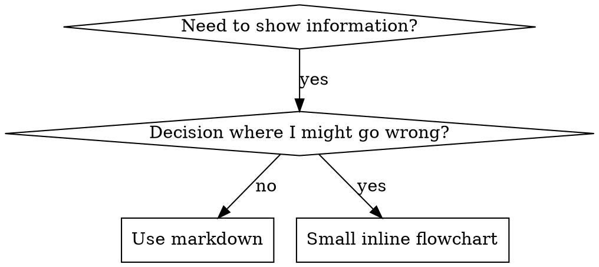

# 编写技能（Writing Skills）

## 概述

**编写技能就是把测试驱动开发（TDD）用到流程文档上。**

技能放在运行时的技能目录里：Eta 的技能目录是 `/var/minis/skills/<skill-id>/`，技能通过索引按需加载正文（先加载 name 与 description，需要时才读 SKILL.md，再需要时才读附带的 reference 文件）。

你写测试用例（用子代理跑压力场景），看它失败（基线行为），写技能（文档），看测试通过（代理开始遵守），再重构（堵漏洞）。

**核心原则：** 如果你没有亲眼看过代理在没有这个技能时失败，你就不知道这个技能教的是不是真需要的东西。

**本技能自带背景：** RED-GREEN-REFACTOR 周期由本文档直接定义（RED = 没有技能时跑基线、看它失败；GREEN = 写出最小技能让它通过；REFACTOR = 堵住新出现的狡辩）。编写技能前先读懂本文档的这两节，再开工。

**官方指南：** Anthropic 官方的技能编写最佳实践见本目录 [anthropic-best-practices.md](anthropic-best-practices.md)，它提供与本文 TDD 视角互补的模式和准则。

## 什么是技能

**技能**是经过验证的技术、模式或工具的参考指南。技能帮后续的代理找到并应用有效做法。

**技能是：** 可复用的技术、模式、工具、参考指南

**技能不是：** 讲述你某次怎么解决问题的流水账

## 技能创作的 TDD 映射

| TDD 概念 | 技能创作 |
|-------------|----------------|
| **测试用例** | 用子代理跑压力场景 |
| **生产代码** | 技能文档（SKILL.md） |
| **测试失败（RED）** | 没有技能时代理违反规则（基线） |
| **测试通过（GREEN）** | 有技能时代理遵守规则 |
| **重构** | 在保持遵守的前提下堵漏洞 |
| **先写测试** | 写技能之前先跑基线场景 |
| **看它失败** | 记录代理实际使用的原话式借口 |
| **最小代码** | 只针对这些具体违规写技能 |
| **看它通过** | 验证代理现在遵守 |
| **重构循环** | 发现新借口 → 堵上 → 再验证 |

整个技能创作流程都遵循 RED-GREEN-REFACTOR。

## 什么时候该创建技能

**该创建：**
- 这项技术对你并不显然
- 你跨项目还会再参考它
- 模式适用范围广（不是项目专属）
- 别人也能受益

**不该创建：**
- 一次性的解法
- 别处已有良好文档的标准做法
- 项目专属约定（写进项目的记忆/说明文件）
- 机械性约束（能用正则/校验自动化的就自动化，文档留给需要判断的地方）

## 技能类型

### 技术（Technique）
有步骤可循的具体方法（condition-based-waiting、root-cause-tracing）

### 模式（Pattern）
思考问题的方式（flatten-with-flags、test-invariants）

### 参考（Reference）
API 文档、语法指南、工具说明

## 目录结构

```
/var/minis/skills/
  <skill-id>/
    SKILL.md              # 主文件（必需）
    supporting-file.*     # 只在需要时附带
```

**扁平命名空间** —— 所有技能在同一个可按 description 检索的空间里。

**拆成独立文件的情况：**
1. **重型参考**（100 行以上）—— API 文档、完整语法说明
2. **可复用工具** —— 脚本、工具、模板（注意：脚本由主代理用 `terminal` 执行，子代理不能执行 shell，所以不要把它写成子代理的步骤）

**留在正文里：**
- 原则与概念
- 代码模式（少于 50 行）
- 其他一切

## SKILL.md 结构

**frontmatter（YAML）：**
- 两个必填字段：`name` 与 `description`
- 总计不超过 1024 字符
- `name`：只用字母、数字和连字符（不要括号、特殊字符）
- `description`：第三人称，只描述**何时使用**，不要描述它做什么
  - 以 "Use when..." 开头，聚焦触发条件
  - 写明具体症状、处境与场景
  - **绝不概括技能的流程或工作流**（原因见下面 SDO 一节）
  - 尽量控制在 500 字符以内

```markdown
---
name: Skill-Name-With-Hyphens
description: Use when [具体的触发条件与症状]
---

# 技能名

## Overview
这是什么？1-2 句核心原则。

## When to Use
[决策不显然时才放小型内联流程图]

带症状与使用场景的要点清单
以及不该使用的情况

## Core Pattern（技术/模式类）
前后对比代码

## Quick Reference
便于扫读的表格或要点

## Implementation
简单模式用内联代码
重型参考或可复用工具用文件链接

## Common Mistakes
常见错法与修正

## Real-World Impact（可选）
具体结果
```

## 技能发现优化（SDO）

**对“被发现”至关重要：** 后续的代理得**找得到**你的技能。

### 1. 信息量足够的 description

**目的：** 代理读 description 来决定当前任务该加载哪个技能。它要能回答：“我现在该读这个技能吗？”

**格式：** 以 "Use when..." 开头，聚焦触发条件

**关键：description = 何时使用，而不是技能做什么**

description 只描述触发条件。不要在 description 里概括技能的流程或工作流。

**为什么重要：** 实测发现，当 description 概括了工作流，代理可能照着 description 做，而不去读技能正文。一条写着“任务之间做代码评审”的 description 让代理只做了一次评审，而技能里的流程图明确画的是两次（先规格合规、再代码质量）。把 description 改成只说“Use when executing implementation plans with independent tasks”（不概括流程）之后，代理正确读了流程图并执行了两阶段评审。

**陷阱：** 概括工作流的 description 会给代理造一条捷径，技能正文成了被跳过的文档。

```yaml
# ❌ 差：概括了工作流 —— 代理可能照它做而不读技能
description: Use when executing plans - dispatches subagent per task with code review between tasks

# ❌ 差：流程细节过多
description: Use for TDD - write test first, watch it fail, write minimal code, refactor

# ✅ 好：只写触发条件，不概括工作流
description: Use when executing implementation plans with independent tasks in the current session

# ✅ 好：只有触发条件
description: Use when implementing any feature or bugfix, before writing implementation code
```

**内容要求：**
- 用具体的触发器、症状和场景来表明这个技能适用
- 描述**问题**（竞态条件、行为不一致），而不是**特定语言的症状**（setTimeout、sleep）
- 除技能本身就是技术专属的情况，触发器保持技术无关
- 如果技能是技术专属的，在触发器里明确说出来
- 用第三人称写（它会被注入到系统提示里）
- **绝不概括技能的流程或工作流**

```yaml
# ❌ 差：太抽象、太含糊，没说何时用
description: For async testing

# ❌ 差：第一人称
description: I can help you with async tests when they're flaky

# ❌ 差：提到了技术，但技能并不专属该技术
description: Use when tests use setTimeout/sleep and are flaky

# ✅ 好：以 "Use when" 开头，描述问题，不写工作流
description: Use when tests have race conditions, timing dependencies, or pass/fail inconsistently

# ✅ 好：技术专属技能，触发器明确
description: Use when using React Router and handling authentication redirects
```

### 2. 关键词覆盖

用代理会去搜的词：
- 错误信息："Hook timed out"、"ENOTEMPTY"、"race condition"
- 症状："flaky"、"hanging"、"zombie"、"pollution"
- 同义词："timeout/hang/freeze"、"cleanup/teardown/afterEach"
- 工具：实际命令、库名、文件类型

### 3. 命名要有描述性

**主动语态、动词开头：**
- ✅ `creating-skills` 而不是 `skill-creation`
- ✅ `condition-based-waiting` 而不是 `async-test-helpers`

### 4. Token 效率（关键）

**问题：** 高频引用、开场就会加载的技能会进入每一次对话。每个 token 都要算。

**目标字数：**
- 开场工作流：每个 < 150 词
- 高频加载的技能：合计 < 200 词
- 其他技能：< 500 词（仍然要简洁）

**手法：**

**把细节挪到工具帮助里：**
```markdown
# ❌ 差：在 SKILL.md 里罗列所有参数
search-conversations 支持 --text、--both、--after DATE、--before DATE、--limit N

# ✅ 好：指向 --help
search-conversations 支持多种模式和过滤条件，细节见 --help
```

**用交叉引用：**
```markdown
# ❌ 差：重复一遍工作流细节
搜索时，用下面的模板派子代理……
[20 行重复指令]

# ✅ 好：引用兄弟技能
把检索/评审这类活派给子代理（主代理内联做完全部会烧掉大量上下文）。
工作流见本目录下的兄弟技能 <skill-name>。
```

**压缩示例：**
```markdown
# ❌ 差：冗长示例（42 词）
用户: “我们以前在 React Router 里是怎么处理认证错误的？”
你: 我来检索历史对话里的 React Router 认证模式。
[派子代理检索：“React Router authentication error handling 401”]

# ✅ 好：最小示例（20 词）
用户: “React Router 里我们怎么处理认证错误？”
你: 正在检索……
[派子代理 → 综合结论]
```

**消除冗余：**
- 不要重复交叉引用技能里已有的内容
- 不要解释命令本身就能看出的东西
- 同一模式不要给多个示例

**验证：** 需要统计字数/行数时由主代理用 `terminal` 执行（例如对文件做行数/字数统计），子代理不跑命令。

**按“你做了什么”或核心洞见命名：**
- ✅ `condition-based-waiting` > `async-test-helpers`
- ✅ `using-skills` 而不是 `skill-usage`
- ✅ `flatten-with-flags` > `data-structure-refactoring`
- ✅ `root-cause-tracing` > `debugging-techniques`

**处理类的技能用动名词（-ing）效果好：**
- `creating-skills`、`testing-skills`、`debugging-with-logs`
- 主动、描述你正在做的动作

### 5. 交叉引用其他技能

**在文档里引用其他技能时：**

只写技能名，并标明是不是必须：
- ✅ 好：`**必需的子技能：** 使用本目录下的兄弟技能 verification-before-completion`
- ✅ 好：`**必需背景：** 你必须理解本目录下的兄弟技能 systematic-debugging`
- ❌ 差：`See skills/testing/test-driven-development`（看不出是不是必需）
- ❌ 差：把对方 SKILL.md 全文抄进来（技能是按需加载的，抄进来等于每次都全量烧上下文）

**为什么不要复制全文：** 技能目录靠索引按需加载。复制内容既失去按需加载的好处，又制造两份会漂移的真相。

**不要引用不存在的技能：** 引用前确认 `/var/minis/skills/` 下确实有那个目录；没有就把引用删掉，改成自包含的说明。

## 流程图用法



**流程图只用于：**
- 不显然的决策点
- 你可能会提前停下的流程循环
- “什么时候用 A 什么时候用 B”的取舍

**绝不用流程图表示：**
- 参考资料 → 表格、清单
- 代码示例 → Markdown 代码块
- 线性指令 → 编号列表
- 无语义的标签（step1、helper2）

graphviz 风格规则见本目录 [graphviz-conventions.dot](graphviz-conventions.dot)。流程图的渲染由主代理按需用 `terminal` 处理；环境里没有 graphviz 时，就保留 `dot` 源码，不要写依赖渲染工具的步骤。

## 代码示例

**一个优秀示例胜过一堆平庸示例**

选最相关的语言：
- 测试技术 → TypeScript/JavaScript
- 系统调试 → Shell/Python
- 数据处理 → Python

**好示例：**
- 完整、可运行
- 注释写清**为什么**
- 来自真实场景
- 清楚展示模式
- 拿来就能改（不是通用模板）

**不要：**
- 用 5 种以上语言各实现一遍
- 造填空式模板
- 写生造的示例

你很擅长移植 —— 一个好示例就够了。

## 文件组织

### 自包含技能
```
defense-in-depth/
  SKILL.md    # 全部内联
```
适用：内容放得下，不需要重型参考

### 带可复用工具的技能
```
condition-based-waiting/
  SKILL.md    # 概述 + 模式
  example.ts  # 可改用的可用辅助代码
```
适用：工具是可复用代码，不只是叙述

### 带重型参考的技能
```
pptx/
  SKILL.md       # 概述 + 工作流
  pptxgenjs.md   # 600 行 API 参考
  ooxml.md       # 500 行 XML 结构说明
  examples/      # 可读的样例
```
适用：参考资料大到不适合内联

**脚本由谁执行：** 技能若附带脚本，写清楚它是由主代理用 `terminal(environment=linux)` 执行的，并把预期输出与失败信号一并写明。子代理不能执行 shell，因此技能正文里**不要**出现“让子代理跑这个脚本”的步骤。

## 铁律（和 TDD 一样）

```
没有失败的测试，就不许写技能
```

这条对**新技能**和**对已有技能的修改**都成立。

先写技能后测试？删掉，重来。
改了技能却没测？同样是违规。

**没有例外：**
- 不是“只是加一点”
- 不是“只是加一节”
- 不是“文档更新”
- 不要把未测试的改动留着当“参考”
- 不要在跑测试的同时“顺手改”
- 删就是删

**必需背景：** 为什么这件事重要，见本文档的 RED-GREEN-REFACTOR 一节；同样的原则适用于文档。

## 各类技能的测试方式

不同技能类型要不同的测法：

### 纪律型技能（规则/要求）

**例子：** TDD、verification-before-completion、designing-before-coding

**怎么测：**
- 学术性问题：它们理解规则吗？
- 压力场景：压力下还遵守吗？
- 多重压力叠加：时间 + 沉没成本 + 疲惫
- 找出借口，加上明确的挡板

**成功标准：** 代理在最大压力下仍遵守规则

### 技术型技能（操作指南）

**例子：** condition-based-waiting、root-cause-tracing、defensive-programming

**怎么测：**
- 应用场景：能正确应用这项技术吗？
- 变体场景：能处理边界情况吗？
- 缺信息测试：指令有没有缺口？

**成功标准：** 代理能把技术成功用到新场景

### 模式型技能（心智模型）

**例子：** reducing-complexity、information-hiding 概念

**怎么测：**
- 识别场景：能认出模式何时适用吗？
- 应用场景：会用这个心智模型吗？
- 反例：知道什么时候**不**用吗？

**成功标准：** 代理能正确判断何时/如何应用

### 参考型技能（文档/API）

**例子：** API 文档、命令参考、库使用指南

**怎么测：**
- 检索场景：能找到正确的信息吗？
- 应用场景：能用对找到的信息吗？
- 缺口测试：常见用例覆盖到了吗？

**成功标准：** 代理能找到并正确应用参考信息

## 跳过测试的常见借口

| 借口 | 事实 |
|--------|---------|
| “技能显然很清楚” | 你觉得清楚 ≠ 别的代理觉得清楚。去测。 |
| “它只是参考” | 参考也会有缺口和看不懂的段落。测检索。 |
| “测试是过度工程” | 没测过的技能一定有问题。15 分钟测试省下几小时。 |
| “出问题再测” | 出问题 = 代理用不了这个技能。部署前测。 |
| “测起来太麻烦” | 比在生产里调试坏技能省事得多。 |
| “我很有把握它没问题” | 过度自信必然出问题。照测。 |
| “学术评审就够了” | 读 ≠ 用。测应用场景。 |
| “没时间测” | 部署未测技能，之后修它更费时间。 |

**以上全部意味着：部署前必须测。没有例外。**

## 让形式匹配失败类型

写指导之前，先给基线失败分类。对一种失败类型能打出防弹效果的写法，在另一种类型上会明显帮倒忙。

| 基线失败 | 对的形式 | 错的形式 |
|---|---|---|
| 压力下跳过/违反规则（明知故犯） | 禁止 + 借口对照表 + 危险信号清单（见下文“防弹化”） | 软性提示（“尽量…”、“可以考虑…”） |
| 遵守了，但产出形状不对（提示词臃肿、结论被埋、复述需求） | 正向配方或契约：说清产出**是**什么——由哪些部分、按什么顺序 | 禁止清单（“不要复述”、“绝不叙述过程”） |
| 本该产出里漏了必需元素 | 结构性：在他们要填的模板里设 REQUIRED 字段或槽位 | 模板旁边的散文式提醒 |
| 行为应依赖某个条件 | 以可观测谓词为键的条件式（“如果计划文件存在，就引用它”） | 无条件规则 + 豁免条款 |

**为什么禁止式写法在“塑形”问题上帮倒忙：** 在竞争性激励下（“让提示词自包含”），代理会跟“不要 X”讨价还价。在派发提示词指导的正面对比测试里，禁止式那一组产出的多余内容明显多于配方式那一组（分布完全分离），甚至比“完全不给指导”的对照组还差。每个案子都该自己微测，不要假定；但**默认不要伸手去拿禁止式写法**。配方式没有可谈判的空间：输出要么符合声明的形状，要么不符合。

**无论选哪种形式，都遵守：**
- **不写“细微差别”条款。** “除非很重要否则不要 X”会重新打开谈判——在同一批用词测试里，给一个原本有效的配方追加一条这样的条款，效果从稳定变成嘈杂。真的有例外，就把它写成以可观测谓词为键的独立条件式。
- **豁免条款圈不住范围。** “这个限制不适用于代码块”仍然会压制代码块输出。如果有一部分输出必须豁免，就重构结构，让规则够不到它。

## 让技能对狡辩免疫

执行纪律的技能（比如 TDD）必须能对抗狡辩。代理很聪明，压力下会找漏洞。

**适用范围：** 这套工具针对的是纪律失败——代理知道规则，但压力下跳过它。对“形状不对的输出”或“漏了元素”，禁止式的防弹化会帮倒忙；请用上一节“让形式匹配失败类型”里的形式。

**心理学背景：** 理解说服技巧为什么有效，能帮你系统地使用它们。研究基础（Cialdini, 2021；Meincke 等, 2025）关于权威、承诺、稀缺、社会认同与共同体原则的说明见本目录 [persuasion-principles.md](persuasion-principles.md)。

### 明确堵上每个漏洞

不要只写规则 —— 把具体的绕道也禁掉：

<Bad>
```markdown
写测试前先写了代码？删掉。
```
</Bad>

<Good>
```markdown
写测试前先写了代码？删掉。重来。

**没有例外：**
- 不要留着当“参考”
- 不要一边写测试一边“顺手改”
- 不要去看它
- 删就是删
```
</Good>

### 回应“精神 vs 字面”的争论

把基础原则写在前面：

```markdown
**违反规则的字面，就是违反规则的精神。**
```

这一句能切断整类“我在遵循精神”的狡辩。

### 建立借口对照表

把基线测试里收集到的借口都写进表里：

```markdown
| 借口 | 事实 |
|--------|---------|
| “太简单不用测” | 简单的代码也会坏。测一次 30 秒。 |
| “我待会儿测” | 测试立刻通过什么都证明不了。 |
| “补测试也能达到同样目的” | 补测 = “这个做了什么？”；先测 = “这个该做什么？” |
```

### 建立危险信号清单

让代理在狡辩时便于自查：

```markdown
## 危险信号 —— 停，重来

- 先写代码后写测试
- “我已经手工测过了”
- “补测试也能达到同样目的”
- “关键是精神不是仪式”
- “这次不一样，因为……”

**以上全部意味着：删掉代码，回到 TDD 重来。**
```

### 按违规症状更新 SDO

把“你即将违规时”的症状加进 description：

```yaml
description: Use when implementing any feature or bugfix, before writing implementation code
```

## 技能的 RED-GREEN-REFACTOR

按 TDD 周期走：

### RED：先写会失败的测试（基线）

**在没有技能的情况下**用子代理跑压力场景。记录实际发生的可观测行为：

- 它做了什么选择？（`get_task_result` 报告里的选项与结论）
- 它给的理由是什么？（照抄报告里的原话）
- 哪些压力触发了违规？
- 它交给主代理的产物（它 worktree 里的文件、报告）长什么样？

**重要限制：** 在 Eta 里，主代理读不到子代理的私有推理，也拿不到它的会话历史。你能依凭的只有**可观测输出**：`get_task_result` 返回的报告内容、它写在自己 worktree 里的文件、以及它明确的拒绝与偏差声明。所以基线判据必须落在这三样上 —— 不要写“去读子代理的思维链”这类做不到的步骤。想在报告里拿到原话式借口，就在派发 context 里明确要求：“报告里写清你选了什么、为什么选它，以及你考虑过但放弃的选项。”

这就是“看测试失败” —— 写技能之前，你必须看到代理自然会怎么做。

### GREEN：写出最小技能

针对那些具体借口写技能。不要为假设中的情况加内容。

**在同一批场景下带技能重跑。** 代理现在应该遵守。

### REFACTOR：堵漏洞

代理又找到新借口？加上明确的挡板。重测直到防弹。

### 完整场景之前先微测用词

完整压力场景是最后一道关，但每轮迭代都慢且贵。先用微测验证用词本身：

1. **每次调用用一个全新上下文的样本** —— 在 Eta 里就是派一次性 `delegate_task` 子代理：context 放真实使用场景下的完整上下文（整个技能或整个提示词模板，而不是把某段指导孤立拿出来），任务写成会诱使它犯那个错的具体工作。
2. **永远要有“不给指导”的对照组。** 如果对照组都没犯这个错，那就没什么要修的 —— 停手，不要写这段指导。
3. **每个变体至少 5 次重复。** 单次样本会骗人。
4. **手动读完每一条被标记的命中。** 可以程序化打分，但模板回声和被引用的反例都会伪装成命中；只看自动计数会同时高估失败与成功。
5. **方差也是指标。** 指导生效时，多次重复会收敛到同一种形状。5 次重复给出 5 种不同解释，说明这个措辞不具约束力 —— 先收紧形式，再加字数。

微测验证的是用词；对纪律型技能，它不能替代压力场景。

**测试方法论：** 完整方法见本目录 [testing-skills-with-subagents.md](testing-skills-with-subagents.md)：
- 怎么写压力场景
- 压力类型（时间、沉没成本、权威、疲惫）
- 系统性地堵洞
- 元测试技巧

一个完整的实测案例（测试技能发现文档的不同写法）见 [examples/skill-discovery-testing.md](examples/skill-discovery-testing.md)。

## 反模式

### ❌ 叙述式示例
“在 2025-10-03 那次会话里，我们发现空 projectDir 会导致……”
**为什么不好：** 太具体，不可复用

### ❌ 多语言稀释
example-js.js、example-py.py、example-go.go
**为什么不好：** 质量平庸，维护负担

### ❌ 流程图里放代码
```dot
step1 [label="import fs"];
step2 [label="read file"];
```
**为什么不好：** 不能复制粘贴，难读

### ❌ 无意义标签
helper1、helper2、step3、pattern4
**为什么不好：** 标签应当有语义

## 停：进入下一个技能之前

**写完任何技能之后，你必须停下来，把部署流程走完。**

**不要：**
- 不逐个测试就批量创建多个技能
- 当前技能还没验证就写下一个
- 以“批量更高效”为理由跳过测试

**下面这份部署清单对每一个技能都是强制的。**

部署未测的技能 = 部署未测的代码。这违反质量标准。

## 技能创作清单（TDD 版）

**重要：在回复里用编号清单逐项跟踪（Eta 没有 todo 工具）。**

**RED 阶段 —— 先写会失败的测试：**
- [ ] 设计压力场景（纪律型技能要 3 种以上压力叠加）
- [ ] 不带技能跑场景 —— 记录基线行为（`get_task_result` 报告原话 + 产物）
- [ ] 归纳借口/失败的模式

**GREEN 阶段 —— 写最小技能：**
- [ ] name 只用字母、数字、连字符（不要括号/特殊字符）
- [ ] YAML frontmatter 含必填的 `name` 与 `description`（合计不超过 1024 字符）
- [ ] description 以 "Use when..." 开头，含具体触发器/症状
- [ ] description 用第三人称
- [ ] 全文有关键词便于检索（错误信息、症状、工具）
- [ ] 有清楚的总览与核心原则
- [ ] 针对 RED 阶段发现的具体失败
- [ ] 指导形式匹配失败类型（见“让形式匹配失败类型”）
- [ ] 对“塑形类”指导：已针对不给指导的对照组做过用词微测（每个变体 5 次以上重复，每一条命中都人工读过）—— 纯参考型技能不适用
- [ ] 代码内联，或链接到独立文件
- [ ] 一个优秀示例（不要多语言各来一份）
- [ ] 带技能重跑场景 —— 确认代理现在遵守

**REFACTOR 阶段 —— 堵漏洞：**
- [ ] 找出测试中出现的新借口
- [ ] 加明确挡板（纪律型技能）
- [ ] 用所有测试轮次构建借口对照表
- [ ] 建立危险信号清单
- [ ] 重测到防弹为止

**质量检查：**
- [ ] 只在决策不显然时才放小型流程图
- [ ] 有快速参考表
- [ ] 有常见错误一节
- [ ] 没有叙述式讲故事
- [ ] 附带文件只用于工具或重型参考

**部署：**
- [ ] 技能目录落到 `/var/minis/skills/<skill-id>/`：implementation 子代理在自己的隔离 worktree 里写文件，由主代理用 `manage_agent_workspace` 收尾并落到技能目录；不要 push，也不要自己建/删 worktree
- [ ] 部署后按索引复核一次：name 与 description 能被正确匹配到触发场景

## 发现流程

后续的代理是怎么找到你的技能的：

1. **遇到问题**（“测试很 flaky”）
2. **按 description 在技能索引里匹配**（加载的是 name 与 description）
3. **命中 SKILL**（description 匹配）
4. **扫一眼概述**（相关吗？）
5. **读模式**（快速参考表）
6. **加载示例**（只在真要动手时）

**为这条流程优化** —— 把可检索的词放在前面、反复出现。
